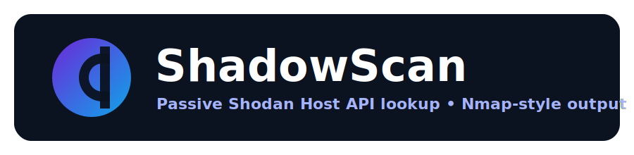

<p align="center">
  
</p>

<p align="center">
  <a href="https://github.com/vgg-dev/shadowscan/releases">
    
  </a>
  <a href="LICENSE">
    
  </a>
  <a href="https://github.com/vgg-dev/shadowscan/actions/workflows/ci.yml">
    
  </a>
  <a href="https://github.com/vgg-dev/shadowscan/actions/workflows/release.yml">
    
  </a>
  
  <a href="https://github.com/vgg-dev/shadowscan/releases">
    
  </a>
  <a href="https://github.com/vgg-dev/shadowscan/commits/main">
    
  </a>
</p>

ShadowScan is a small CLI that queries the Shodan Host API for one or more hosts and prints **Nmap-style** output.

> [!IMPORTANT]
> Use ShadowScan only on hosts you are authorized to assess.
>
> ShadowScan is a **passive lookup tool** (it does not probe/scan targets). Output reflects what Shodan has indexed.

## ✨ Features

- 🕵️ Passive Shodan Host API lookup (no scanning)
- 🎯 Multi-target input: positional targets, `--input`, and `--cidr`
- 🧰 Filters: `--ports`, `--proto`, `--service`, `--grep`
- 🧾 Output: `--format nmap|summary|json|ndjson|grep|xml` plus `-oN/-oG/-oX`
- 💾 Caching: `--cache-dir`, `--cache-ttl`, `--no-cache`
- 🧯 Safety rails: `--authorized-scope`, `--dry-run`, `--max-targets`

## ⚡ Quickstart

```powershell
# API key (current session)
$env:SHODAN_API_KEY = "YOUR_KEY"

# Single target
python .\shadowscan.py 8.8.8.8

# File input
python .\shadowscan.py --input targets.txt

# CIDR with allowlist
python .\shadowscan.py --cidr 10.0.0.0/24 --authorized-scope scope.txt
```

## 📦 Install

Requirements:

- Python 3.9+
- A Shodan API key in `SHODAN_API_KEY`


Install options:

```powershell
# Install the latest release (recommended)
pipx install "git+https://github.com/vgg-dev/shadowscan.git@v0.1.0"

# Or install from main
pipx install "git+https://github.com/vgg-dev/shadowscan.git@main"
```

Run as:

```powershell
shadowscan --help
shadowscan 8.8.8.8
```

Optional (virtual environment):

```powershell
python -m venv .venv
.\.venv\Scripts\Activate.ps1
```

## 🧪 Examples

Single target (default Nmap-style):

```powershell
python .\shadowscan.py 8.8.8.8
python .\shadowscan.py example.com --resolve
```

Multiple targets:

```powershell
python .\shadowscan.py --input targets.txt
python .\shadowscan.py --cidr 10.0.0.0/24
python .\shadowscan.py 1.1.1.1 8.8.8.8
```

Filters + banners:

```powershell
python .\shadowscan.py 8.8.8.8 --ports 80,443 --show-banners
python .\shadowscan.py 8.8.8.8 --grep "nginx" --show-banners
```

Raw JSON / pipelines:

```powershell
python .\shadowscan.py 8.8.8.8 --format json
python .\shadowscan.py --input targets.txt --format ndjson
```

Write Nmap-ish output files:

```powershell
python .\shadowscan.py --input targets.txt -oN out.txt -oG out.grep -oX out.xml
```

## 🧷 Safety

To help avoid accidental lookups outside an authorized scope:

- `--authorized-scope scope.txt` blocks targets not in the allowlist (CIDRs/IPs; `#` comments supported)
- `--dry-run` prints the resolved targets and exits (no API calls)
- `--max-targets` limits `--cidr` expansion unless `--allow-large` is set
- `--force` overrides allowlist blocking (use with care)

## 🗂️ Output

Primary stdout formats:

```powershell
python .\shadowscan.py 8.8.8.8 --format nmap
python .\shadowscan.py 8.8.8.8 --format summary
python .\shadowscan.py 8.8.8.8 --format json
python .\shadowscan.py --input targets.txt --format ndjson
python .\shadowscan.py 8.8.8.8 --format grep
python .\shadowscan.py 8.8.8.8 --format xml
```

## 💾 Caching

By default, responses are cached to `.shadowscan-cache/` for 1 hour.

```powershell
python .\shadowscan.py 8.8.8.8 --cache-ttl 0          # disable cache reads (always refresh)
python .\shadowscan.py 8.8.8.8 --no-cache             # disable cache reads/writes
python .\shadowscan.py 8.8.8.8 --cache-ttl 86400      # 24h TTL
```

## 🛠️ Troubleshooting

- **401/403**: verify `SHODAN_API_KEY` is set and has access to the Host API.
- **429** (rate limit): use `--retries`/`--backoff` and reduce target count.
- **Name resolution errors**: use an IP directly, or check DNS; `--resolve` is only for hostnames.

## 🔐 Security notes

- Do not commit API keys.
- Raw JSON output can contain service banners; treat it as potentially sensitive.

## 🚀 CI/CD

- CI runs on every push/PR via GitHub Actions.
- Releases: push a tag like `v0.1.0` to build `dist/*` and create a GitHub Release.
- Optional PyPI publish: set repo secret `PYPI_API_TOKEN` to enable publishing.

Tag example:

```powershell
git tag v0.1.0
git push origin v0.1.0
```

## 📄 License

MIT — see `LICENSE`.

